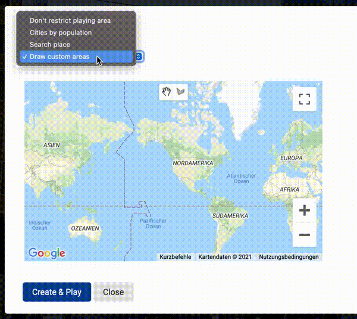

<h1 align="center">
  <br>
  <a href="https://github.com/gsx95/georgguessr"></a>
</h1>

<h4 align="center">An open source clone of <a href="https://geoguessr.com" target="_blank">Geoguessr</a> for you to use.</h4>

<p align="center">
</p>

<p align="center">
  <a href="#key-features">Key Features</a> •
  <a href="#how-to-build">How To Use</a> •
  <a href="#license">Development</a> •
  <a href="#license">License</a>
</p>
<p align="center">

</p>

## Key Features

* Play Alone or with friends
  - 1 to 10 players
  - set time limit from 30s to 20m or no time limit at all
* Play in your favorite places
  - Search for places
  - draw custom play areas
  - play all big cities in your favorite country
  - just play randomly in the whole world

<p align="middle">

 
</p>

* Overview of all player's picks after each round
  - see which locations your friends picked and how far they were off

<p align="middle">

 
</p>

* Various options for streetview
  - show street names? 
  - show compass?
  - building information on mini map?
* No login required
  - Share games and invite friends with a simple link
* Easy and cheap hosting in AWS
  - Easy: Fully serverless - uses AWS SAM to deploy the backend and static HTML files for the frontend
  - Cheap: Uses AWS Lambda, API Gateway and DynamoDB for cheap hosting (first ~50k games per month fall into the AWS free tier)


## How to build

To clone and run this application, you'll need [npm](https://www.npmjs.com), [AWS SAM CLI](https://docs.aws.amazon.com/serverless-application-model/latest/developerguide/serverless-sam-cli-install.html), [AWS CLI](https://docs.aws.amazon.com/cli/latest/userguide/cli-chap-welcome.html) and [GoLang >1.16](https://golang.org) installed on your computer. From your command line:

```bash
# Clone this repository
$ git clone git@github.com:gsx95/georgguessr.git

# Go into the repository
$ cd georgguessr

# Build and deploy to your AWS account. Displays changeset before deploying anything
$ ./make.sh guided

# On your first deployment with `./make.sh guided`, you can choose to save your AWS account information in a local file. If you do so, you can just use './make.sh' in the future
```

## Development

When developing, I tend to deploy the backend to my AWS account and use node's http-server to quickly spin up the frontend locally.

Sometimes, you only want to update the backend / the frontend. Use `./make.sh frontend` to only rebuild the frontend and `./make.sh backend` to only update the backend. 
## License

MIT